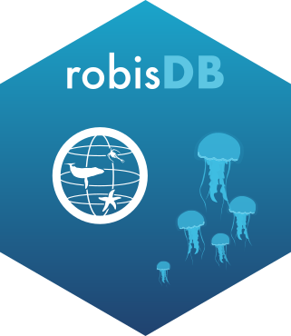

# robisdb: easier access to OBIS Parquet datasets <a href="https://github.com/iobis/robisdb"></a>

Fast, local access to [OBIS](https://obis.org) (Ocean Biodiversity Information System) data.

`robisdb` queries OBIS's public [Parquet snapshots](https://github.com/iobis/obis-open-data)
directly with [DuckDB](https://duckdb.org). This can be used for analysis with the main OBIS
data (available on [AWS](https://github.com/iobis/obis-open-data)) or when working with other
derived datasets like [speciesgrids](https://github.com/iobis/speciesgrids) and
[obistherm](https://github.com/iobis/obistherm). Where it makes sense, `robisdb` mirrors
`robis`'s own functions so the two feel familiar side by side. Working with the Parquet
version of the main OBIS data is especially recommended for large-scale analysis.

> [!NOTE]
> This package is still under development. Report any issues to https://github.com/iobis/robisdb/issues

## Installation

```r
# install.packages("pak")
pak::pak("iobis/robisdb")
```

## Getting a local copy of the data

Streaming directly from S3 works, but will be slow in most cases. For real use, sync a
local copy first:

```r
library(robisdb)

# ~ a few hundred GB -- do this once, then re-run occasionally to pick up updates
sync_opendata("~/data/obis-open-data")

# or, if you have the AWS CLI installed, this is often faster (parallel transfers, retries)
sync_opendata_cli("~/data/obis-open-data")
```

Then connect to the local copy:

```r
con <- connect_opendata_local("~/data/obis-open-data")
con
#> ── robisdb connection ──
#> Connected with open-data-local
#> Status: active
#> Local folder: ~/data/obis-open-data
#> Connection created at 2026-07-10 ...
```

(`connect_opendata()` streams directly from S3 instead, if you don't want a local copy yet.
`connect_speciesgrids()`/`connect_obistherm()` and their `_local` variants work the same way
for OBIS's other two datasets.)

Currently we offer connections to three datasets:

1. [`open-data` - OBIS full data on AWS](https://github.com/iobis/obis-open-data)
2. [`speciesgrids` - gridded dataset with all marine records on OBIS and GBIF](https://github.com/iobis/speciesgrids)
3. [`obistherm` - extends the OBIS main data with monthly sea temperature information](https://github.com/iobis/obistherm)

Working directly with the S3 versions (no local sync) can still be reasonable if:

1. You are working with `speciesgrids`, which is small enough to stream directly, or
2. You are targeting a small subset of `open-data` (the full OBIS dataset) -- in this case,
   make sure to filter by `dataset_id`.

## Occurrence records: `occurrence_db()`

The simplest way to query the `open-data` dataset -- `occurrence_db()` mirrors
[`robis::occurrence()`](https://iobis.github.io/robis/reference/occurrence.html):

```r
occ <- con |> occurrence_db(scientificname = "Minuca rapax")
occ <- con |> occurrence_db(taxonid = 955271)   # same species, by AphiaID

nrow(occ)
#> [1] 75
```

By default you get a curated set of commonly-used fields (fast to scan); pass
`fields = "all"` for every available Darwin Core field, or `fields = c(...)` for exactly the
ones you want:

```r
con |> occurrence_db(taxonid = 955271, fields = c("scientificName", "decimalLongitude", "decimalLatitude"))
```

> [!TIP]
> Selecting only the columns you need is the **best** way to speed up computations and
> reduce memory use. You can also pre-filter the data at connection time, via the `select`
> and `where` arguments of `connect()` (and its `connect_*()` wrappers).

Measurement (`mof`) and DNA-derived-data (`dna`) extensions come back as list-columns, one
row per occurrence, each holding that occurrence's own measurement/DNA records:

```r
occ <- con |> occurrence_db(taxonid = 955271, mof = TRUE)
occ$mof[[1]]
#> # A tibble: 4 × 14
#>   measurementType measurementValue measurementUnit ...
#>   ...

# flatten to one row per measurement instead:
measurements_db(occ)
#> # A tibble: ... × 3
#>   id    measurementType measurementValue
#>   ...

# same idea for DNA-derived data:
occ_dna <- con |> occurrence_db(taxonid = 955271, dna = TRUE)
dna_db(occ_dna)
```

Filter on geometry, dates, depth, quality flags, and more -- see `?occurrence_db` for the
full parameter list (it closely follows `robis::occurrence()`'s).

Set `verbose = TRUE` on any of these functions to print the SQL before it runs.

> [!TIP]
> We recommend setting `verbose = TRUE` while you're learning, because ultimately the best
> way to work with these datasets in DuckDB is to learn SQL yourself. `robisdb` only covers
> the most common operations -- learning SQL will open up many more possibilities. Check out
> the [SQL introduction](sql-intro.md) for the basics.

## Species checklists: `checklist_db()`

Mirrors [`robis::checklist()`](https://iobis.github.io/robis/reference/checklist.html): one
row per distinct taxon matched by the filters, with a `records` column (occurrence count for
that taxon), sorted descending:

```r
con |> checklist_db(geometry = "POLYGON((-56 -34, -34 -34, -34 3, -56 3, -56 -34))")
#> # A tibble: ... × 43
#>   scientificName scientificNameAuthorship taxonRank kingdom phylum ... records
#>   ...
```

## Building a query by hand

For anything the functions above don't cover, a small set of `select_db()`/`mutate_db()`/
`filter_db()`/`group_by_db()`/`summarize_db()`/`collect_db()` verbs let you build a query
step by step against the underlying `obis` view.

This isn't meant to cover every possible query, and it isn't meant to replace `duckplyr`
either -- but `duckplyr` doesn't (yet) work well with `open-data`'s nested structure, and it
carries a [fallback-to-full-materialization risk](#a-note-on-duckplyr) (see below).

Nothing runs until you call `collect_db()` (or `show_sql()`, which only prints the query):

```r
con |>
    select_db(interpreted.scientificName, interpreted.country, interpreted.depth) |>
    filter_db(interpreted.depth > 200, interpreted.country == "Brazil") |>
    show_sql() |>
    collect_db()
```

```
── Query
select
    interpreted.scientificName,
    interpreted.country,
    interpreted.depth
from obis
where
    interpreted.depth > 200
    and interpreted.country = 'Brazil';
```

A bare symbol like `interpreted.depth` is a column reference; if a variable of that name
exists in your own environment, its value is used instead:

```r
depth_limit <- 200
con |> select_db(interpreted.scientificName) |>
    filter_db(interpreted.depth > depth_limit) |>
    collect_db()
```

`group_by_db()` + `summarize_db()`/`summarise_db()` (either spelling works) build aggregates:

```r
con |>
    group_by_db(interpreted.country) |>
    summarize_db(n = n(), mean_depth = mean(interpreted.depth)) |>
    collect_db()
```

`mutate_db()` appends a computed column instead of replacing the select list:

```r
con |> select_db(interpreted.depth) |>
    mutate_db(depth_ft = interpreted.depth * 3.28084) |>
    collect_db()
```

**Always narrow with `select_db()`/`mutate_db()`/`group_by_db()` before `collect_db()`.**
Left untouched, the query defaults to `select *`, which pulls this dataset's full nested
`source`/`interpreted`/`extensions` structs -- slow to materialize at this scale.

For a quick look at the raw schema, `head()`/`glimpse()` always sample a handful of rows
directly, and `colnames()` lists every column name, both ignoring any query you've built:

```r
con |> head(5)
con |> glimpse()
con |> colnames()
#>  [1] "_id"            "_event_id"      "_occurrence_id" "dataset_id"
#>  [5] "node_ids"       "source"         "interpreted"    "extensions"
#>  [9] "missing"        "invalid"        "flags"          "dropped"
#> [13] "absence"        "tags"           "geometry"
```

(`colnames()` is especially handy for `speciesgrids`, which has no nested structs, so its
result is already the full, directly usable field list.)

## Spatial filtering

```r
con |> filter_db(interpreted.aphiaid == 955271) |>
    filter_spatial_db("POLYGON((-56 -34, -34 -34, -34 3, -56 3, -56 -34))") |>
    collect_db()

# or intersect a buffered point instead
con |> filter_spatial_db("POINT(-38 -13)", buffer = 2) |> collect_db()
```

## H3 hexagonal indexing

Convenience wrappers around DuckDB's [`h3` community
extension](https://duckdb.org/community_extensions/extensions/h3) (install it once per
connection with `install_h3(con)`):

```r
install_h3(con)

con |>
    select_db(interpreted.scientificName, interpreted.decimalLongitude, interpreted.decimalLatitude) |>
    h3_index_db(interpreted.decimalLatitude, interpreted.decimalLongitude, resolution = 7) |>
    mutate_db(h3_parent = h3_cell_to_parent(h3_index, resolution = 5)) |>
    collect_db()
```

`h3_parent_db()`/`h3_children_db()` move an existing H3 cell column up/down the resolution
hierarchy the same way.

The H3 extension is especially handy with the [`speciesgrids`](https://github.com/iobis/speciesgrids)
dataset, which already ships a pre-computed H3 (resolution 7) `cell` column -- there's no
need to compute an index yourself, just move it to whichever resolution you need:

```r
con_sg <- connect_speciesgrids_local("~/data/speciesgrids")

# roll up to a coarser resolution (5), e.g. to aggregate by larger hexagons
con_sg |>
    select_db(species, cell) |>
    filter_db(species == "Abra alba") |>
    h3_parent_db(cell, resolution = 5) |>
    collect_db()

# or the reverse: get the finer-resolution (8) children of each grid cell
con_sg |>
    select_db(species, cell) |>
    h3_children_db(cell, resolution = 8) |>
    collect_db()
```

## Working directly with SQL

For anything not covered by the functions above, run SQL yourself with `get_query()`/
`send_query()` -- both accept a `robisdb_conn` directly (or a raw connection, e.g.
`con$connection`, if you have one). See [sql-intro.md](sql-intro.md) for a short primer if
you're new to SQL.

```r
get_query(con, "
    select interpreted.country, count(*) as n
    from obis
    group by interpreted.country
    order by n desc;
")

# send_query() is for statements that don't return rows, e.g. installing an extension
send_query(con, "install json; load json;")
```

If you have your own local Parquet file(s) that aren't one of OBIS's three named datasets,
connect directly with `connect_duckdb()` instead of `connect()`:

```r
con_custom <- connect_duckdb("path/to/my/*.parquet")
con_custom |> head()
```

> [!IMPORTANT]
> For all cases, when you finish querying the dataset remember to close the connection using `disconnect()`.
> Example: 
>```r
con_sg <- connect_speciesgrids_local("~/data/speciesgrids")

# roll up to a coarser resolution (5), e.g. to aggregate by larger hexagons
con_sg |>
    select_db(species, cell) |>
    filter_db(species == "Abra alba") |>
    h3_parent_db(cell, resolution = 5) |>
    collect_db()

# close connection
disconnect(con_sg)
```

## A note on `duckplyr`

[`duckplyr`](https://duckplyr.tidyverse.org) is a great general-purpose lazy `dplyr` backend
for DuckDB (and we recommend it for R users starting to work with DuckDB), but it doesn't
reach `open-data`'s deeply nested struct columns well enough to replace the verbs above, and
it silently materializes the *entire* table into R memory on any operation it can't
translate -- exactly the failure mode this package is built to avoid.

`to_duckplyr(con)` is provided as an explicitly experimental escape hatch for ad hoc
interactive exploration (it flattens `interpreted`/`source`/`extensions` one level via
`dd::unnest()` so plain `dplyr` column names work); narrow with `filter_db()`/`select_db()`
first, and never call it on a fresh, unfiltered connection. See `?manual_query` for the full
reasoning.
